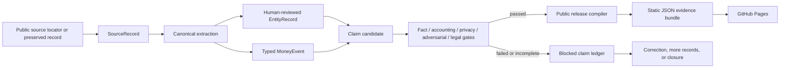
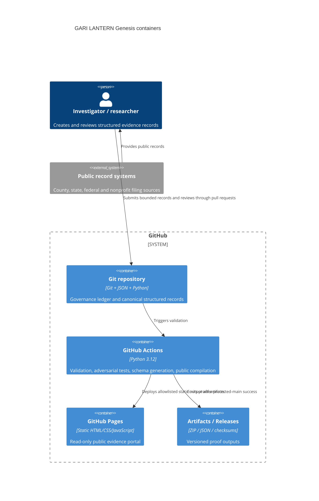
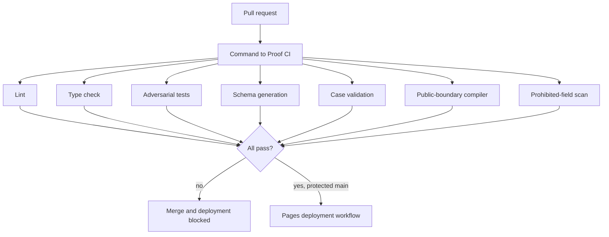

# GARI LANTERN OSS · Genesis Architecture

**Version:** 0.1.0-GENESIS  
**Case namespace:** `LSC-OR-CLATSOP-001`  
**Deployment:** GitHub repository + GitHub Actions + GitHub Pages  
**Posture:** public-source shadow research, no accusation authority

## 1. Senior Architect mandate

The Senior Architect translates institutional doctrine into executable constraints. The role owns system boundaries, schemas, trust zones, threat models, CI gates, deployment topology, failure recovery, acceptance tests and architecture decisions. The role does not decide whether a person or organization committed misconduct and cannot fabricate accounting, legal, privacy, factual or substantive approval.

## 2. Command-to-proof chain



## 3. Trust zones

| Zone | Meaning | Public build behavior |
|---|---|---|
| `candidate` | Machine-generated or unverified research lead | Always excluded |
| `canonical` | Human-reviewed internal record | Excluded unless explicitly promoted |
| `restricted` | Sensitive, legally constrained or source-protected material | Always excluded and build-blocking if marked public |
| `public` | Explicitly approved, non-sensitive record | Eligible for allowlisted compilation |

The release compiler uses an allowlist. It never copies a case directory wholesale.

## 4. Container boundaries



## 5. Canonical object model

- `CaseRecord`: mission boundary, jurisdiction, period and publication authority.
- `SourceRecord`: provenance, source limitations, amendment status and citation locations.
- `EntityRecord`: canonical identity, identifiers, resolution method and reviewer.
- `MoneyEvent`: typed financial event with flow lineage, source records and aggregation permissions.
- `OutcomeRecord`: metric definition, numerator, denominator, attribution class and comparability.
- `ClaimRecord`: exact sentence, support, contrary evidence, alternatives and review gates.
- `CorrectionRecord`: immutable original statement and append-only supersession chain.
- `ReleaseManifest`: commit, software versions, hashes and independent certificates.

## 6. Financial semantics

An amount is never sufficient by itself. Every `MoneyEvent` must state what the number means.

```text
award ≠ obligation ≠ outlay ≠ county receipt ≠ provider allocation
      ≠ reimbursement request ≠ payment ≠ reported expenditure
```

The validator rejects aggregation when:

- event types differ;
- currencies differ;
- no explicit aggregation group exists;
- one selected event is the parent of another selected event;
- any event lacks affirmative aggregation permission.

## 7. AI authority ceiling

GARI may suggest extraction candidates, entity candidates, discrepancies, searches and alternative explanations. `ai_candidate` claims cannot enter public output. AI cannot merge identities, classify illegality, certify accounting, approve publication or alter corrections.

## 8. Publication boundary

The Genesis public portal may show:

- the bounded case mission;
- resolved public entities;
- typed official award or allocation summaries;
- source limitations;
- publication authority;
- the no-misconduct notice;
- methodology and corrections.

It may not show:

- unresolved identities;
- blocked claims;
- confidential tips;
- client-level HMIS or health information;
- internal investigator notes;
- high-risk allegations without every gate;
- a corruption score, fraud probability or suspicion leaderboard.

## 9. GitHub control plane



## 10. Failure modes and responses

| Failure | Required behavior |
|---|---|
| Source changes after acquisition | Preserve prior version and create a source-conflict record |
| Entity identity becomes disputed | Demote match status and remove affected public claims |
| Award confused with payment | Validation failure and correction review |
| Client-level field enters data | Public build fails immediately |
| AI output promoted directly | Public build fails immediately |
| New evidence changes a claim | Preserve original statement and append correction |
| CI fails | No Pages deployment |
| GitHub unavailable | Canonical plain files remain locally reproducible after clone |

## 11. Genesis limitations

- Source files are not yet preserved in an immutable evidence vault; current fixture hashes identify source locator manifests and disclose that limitation.
- No independent forensic accountant, fact checker, privacy officer or Oregon publication counsel has certified the Clatsop claims.
- No final reimbursement, payment, expenditure, utilization or outcome records are represented.
- GitHub Pages is a public static surface, not a confidential research environment.
- Genesis is a working governance kernel and public portal, not a completed institutional audit.

## 12. Promotion path

1. Pass all repository CI and security checks.
2. Preserve complete primary documents and cryptographic hashes.
3. Complete the manual Clatsop shadow case.
4. Add independent role reviews.
5. Add release manifests and correction simulations.
6. Only then consider jurisdiction adapters, automated public ingestion and broader deployments.
